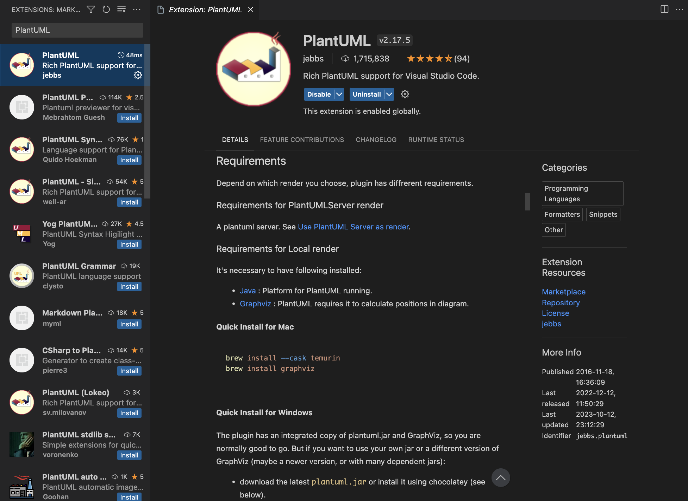
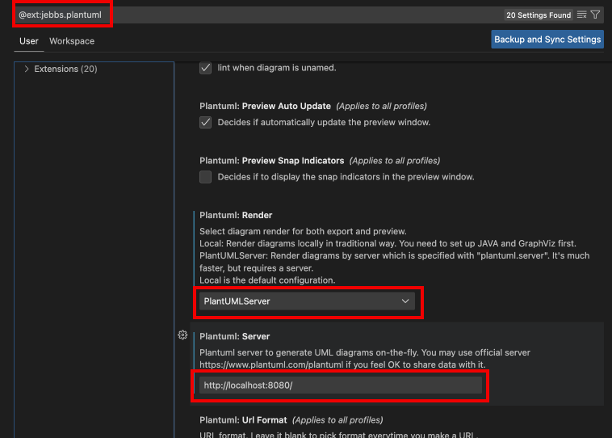

# PlantUML
- [Docs](https://plantuml.com/ja/)

## Initial Setting 

### Install
- docker
- docker compose

### Add VSCode Extensions


### Setting Extensions


## How to Use
- Start docker compose
  ``` 
  docker compose up -d
  ```
- Preview  
  **option + D**
- Output Files  
  1. **"Command + Shift + P"** でコマンドパレットを開く
  1. **PlantUML: Export Current Diagram** と入力する
  1. 出力するファイル形式を選択する